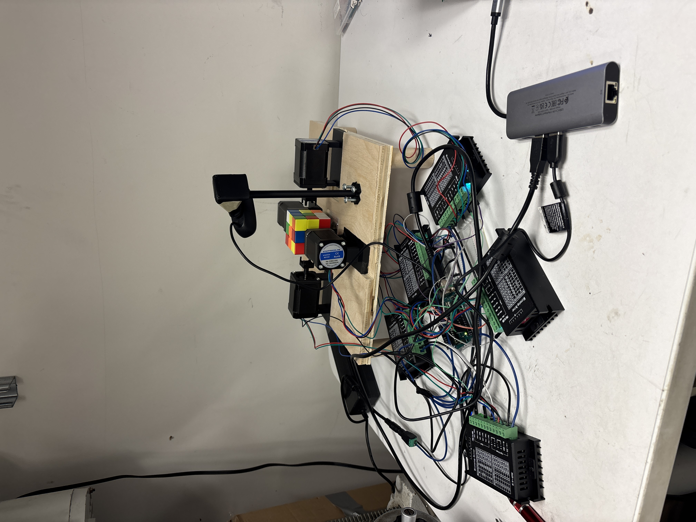
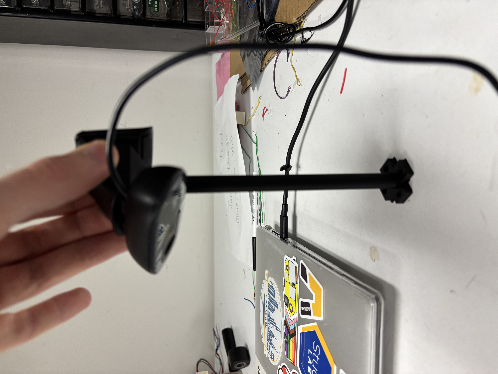
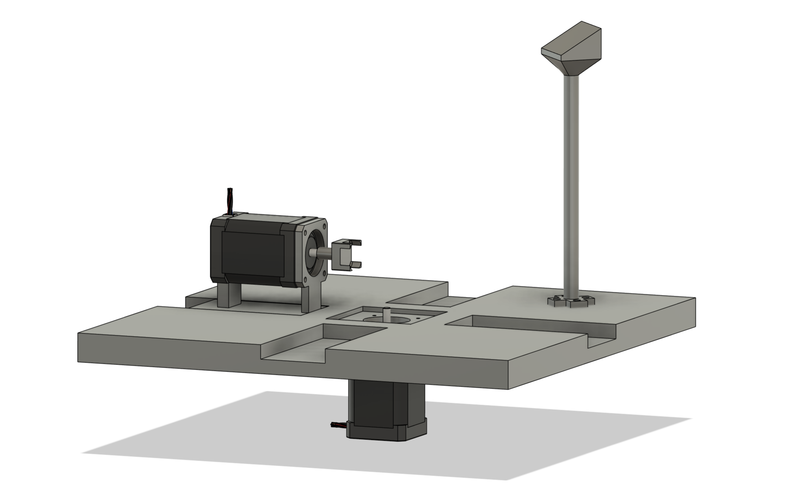
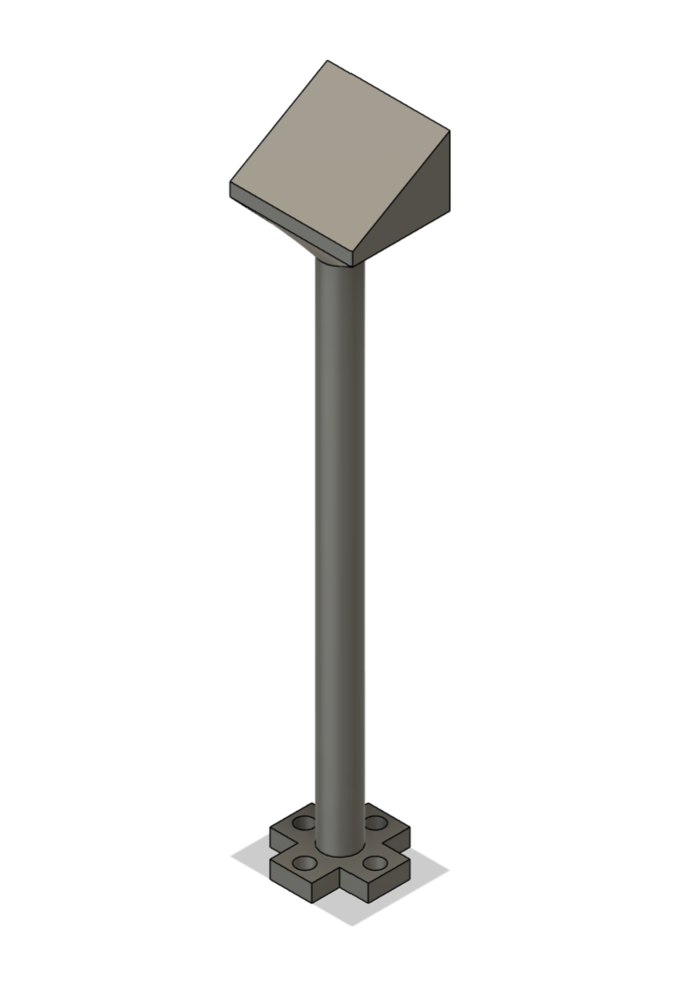
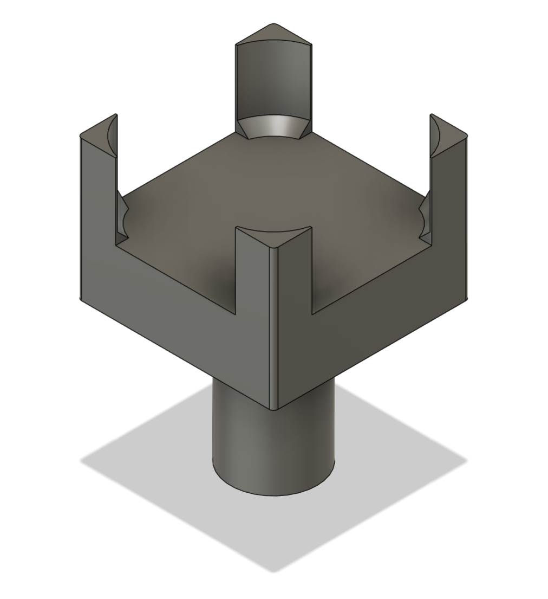
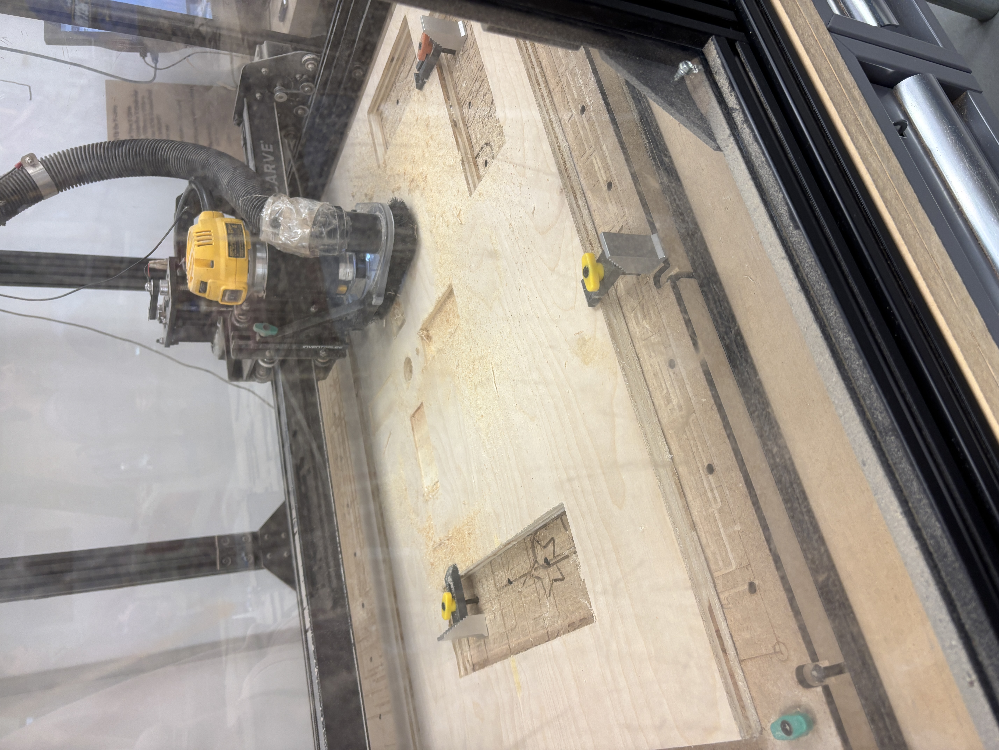
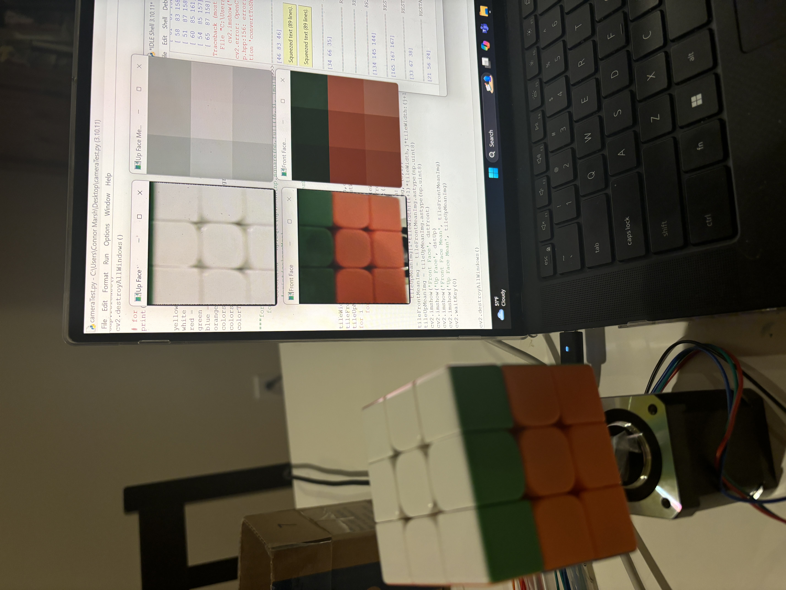
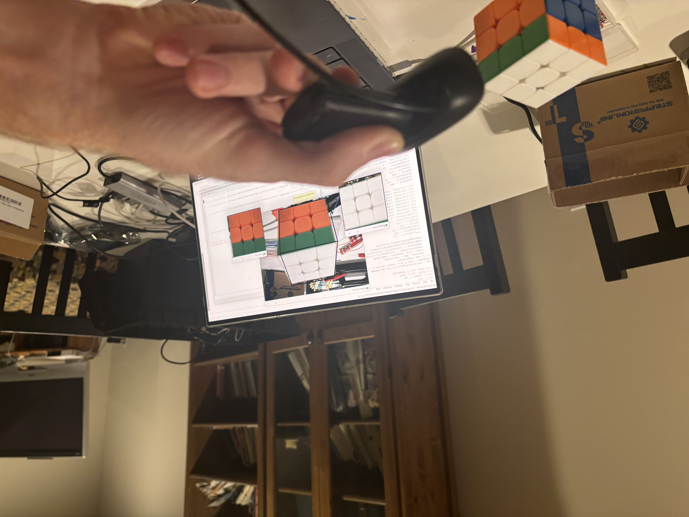

# RubiksBot

Repository for code, schematics, and designs for my Rubik's cube solving robot. This project was made as my final project for the University of Pittsburgh Swanson School of Engineering, Electrical and Computer Engineering class: Junior Design Fundamentals. All purchases made for this project were funded by the Electrical and Computer Engineering department so huge thanks to them and to Dr. Dickerson for creating and teaching this class. This is the third and final project of the class, giving me only a total of 4 weeks to make this project (We technically had 6 weeks but the first two I was too busy with other projects due earlier to start this). The extremely tight 4 week deadline for this project was the main driving factor in many of my design decisions.

### My background
###### Engineering
I have been making hobby coding and engineering projects since middle school. I am currently studying computer engineering at the University of Pittsburgh

###### Rubik's Cubes
I learned how to solve a Rubik's cube in 5th grade. I immediately got into speedcubing after that which is the sport of trying to solve cubes as fast as possible. I wasn't too good in 5th grade my best time was around 40 seconds, and I stopped practicing much by the start of 6th grade. When the COVID lockdown happened in 2020 I picked back up the hobby and improved loads. I got my best solve time down to 9 seconds with an average time of 15 seconds. I also learned how to solve the cube blindfolded and got into an event called MultiBlind, where you have one hour total to memorize as many cubes as you can, put on a blindfold, then solve them all in one go. Here's a link to me doing that on youtube: [My cubing youtube channel](https://www.youtube.com/@5mover131)

### Design basics
###### Inspiration
This robot was partially inspired by the GAN Robot's design which uses 5 total motors, with the 4 equatorial motors being able to move in and out to allow for easy insertion and removal of the cube. I wanted to design this project from scratch and not copy any existing resources, so although I know of the GAN Robot's existence, I deliberately chose to not look at it at all after starting this project. The last time I looked at the GAN Robot was a few years ago when I saw videos of it after its release.
###### Motors
The robot uses 5 Nema17x60mm Stepper motors to turn the cube sides. Each stepper is driven by a TB6600 Stepper Driver. I chose these motors and drivers to guarantee enough torque and speed since with my time constraint on this project I couldn't afford to not have strong enough motors and need to order new ones. I also chose to use Stepper motors for their ease of control/use, and their inherit accuracy. I didn't want to waste valuable time dealing with encoders/other sensors.
The 5 motors are placed similarly to the GAN robot, with one on the bottom and four around the equator. The equator motors are all slotted inside a groove and can slide back and forth to allow for easy cube insertion and removal. In the future I plan to add a mechanism to automatically slide them forward and backwards but right now that needs to be done manually.  
Full setup:  

###### Sensing
There is a camera mounted on the main board where the cube is, positioned above and diagonally away from the cube. This is done so that when the equator motors are pulled back, and the bottom motor rotates the cube to a 45 degree offset from a cardinal direction, the camera can see both the top face and one side face straigth on. Then the bottom motor can rotate 90 degrees 4 times and the camera can take a picture each time. This gets us 4 photos, which show us the top side of the cube (4 times) and each equator side (once). With the knowledge of 5 sides of the cube we can deduce the sixth side easily.  
Camera Mount:  

###### Solving
There is an existing algorithm called Kociemba's algorithm which has been mathematically proven to be the optimal algorithm for solving any possible cube state. With my time constraint I didn't want to spend time creating my own cube solving implementation so I decided to just copy the source code for Kociemba's algorithm from an open source github page I found. It does need to be a slightly modified Kociemba because we only have 5 degrees of freedom, when the normal algorithm assumes 6.

###### Control
Currently the robot is controlled by having my computer send motor angles to an Arduino via Serial, and the Arduino is running a program that just constantly reads motor angles from Serial and turning the steppers to those angles accordingly. It also does some additional processing to do thing like smoothly accelerating and deaccelerating the motors etc.

###### CAD Modeling
The robot was modeled in Fusion360 all the parts were either printed on RAS’s Bambu X1 Carbon, the Prusa in the Classroom to community room 437, or machined on the makerspace’s xcarve!  
Full robot CAD (with only one of the equator motors visible for clarity):
  
Camera mount CAD:  
  
Motor shaft adapter/cube turner CAD:  
  
Board being machine on the XCARVE:  

###### Preliminary Testing
Over thanksgiving break I did a lot of preliminary testing for the motor driving and control, and for the computer vision, as those were two components of the project I could work on from home and figured would be very important and time consuming.  
To test the motors I just used my Arduino plus one motor and one driver. At the time I only had 1 motor and 3 drivers because of issues with ordering parts from amazon but it was all good.
Testing the max speed I could drive the cube:  

For CV Testing, I just used an old webcam I had on hand and started figuring out my CV program, I got most of this done over break and just needed fine tuning/improvements to be done later for increased accuracy!  
CV Test setup:  
  

##### Final Design Testing
To test my design I setup the robot in the RAS shop and individually tested and confirmed functionality of all the important components: motor control, CV, and cube solving algorithm. To confirm motor control I had an Arduino program that just did hardcoded move sequences. To test CV I just took the pictures manually and made sure the cube state outputs were correct. And to test the cube solving algorithm I manually typed in the cube state, got the solution, then manually performed the solution to make sure it solved the cube.  
After I got these 3 major components working independently, I combined them all together into the main program, which included interfacing my computer with the Arduino via serial. When everything was put together it introduced some bugs as expected but they were all easily resolved.  
###### Some issues I had along the way and how I fixed them
Red and orange being very similar and hard to distinguish. I fixed this by sorting the 18 most red and orange seeming pieces by hue and taking the 9 lowest hues and calling them red and the 9 highest and calling them oranged. This fixed the problem of the actual threshold changing based on lighting and shadows.  
Cube jamming and vibrations. When I tried to run the cube at a high speed the motors would vibrate too much and cause jams. I fixed this by adding acceleration into the motor control to smooth out the starts and ends of the turns while still allowing a very high max speed!  
##### Summary and future work
In summary this was a great success! As you saw during the live demonstration the robot is working very well! It solves the cube *most* of the time apart from small mechanical issues that can be fixed later. For future work, I would improve the solving algorithm to go from 60 move solves on average to 25. And I would also add linear actuators on the equator motors to make them move in and out automatically for a fully automated system.

